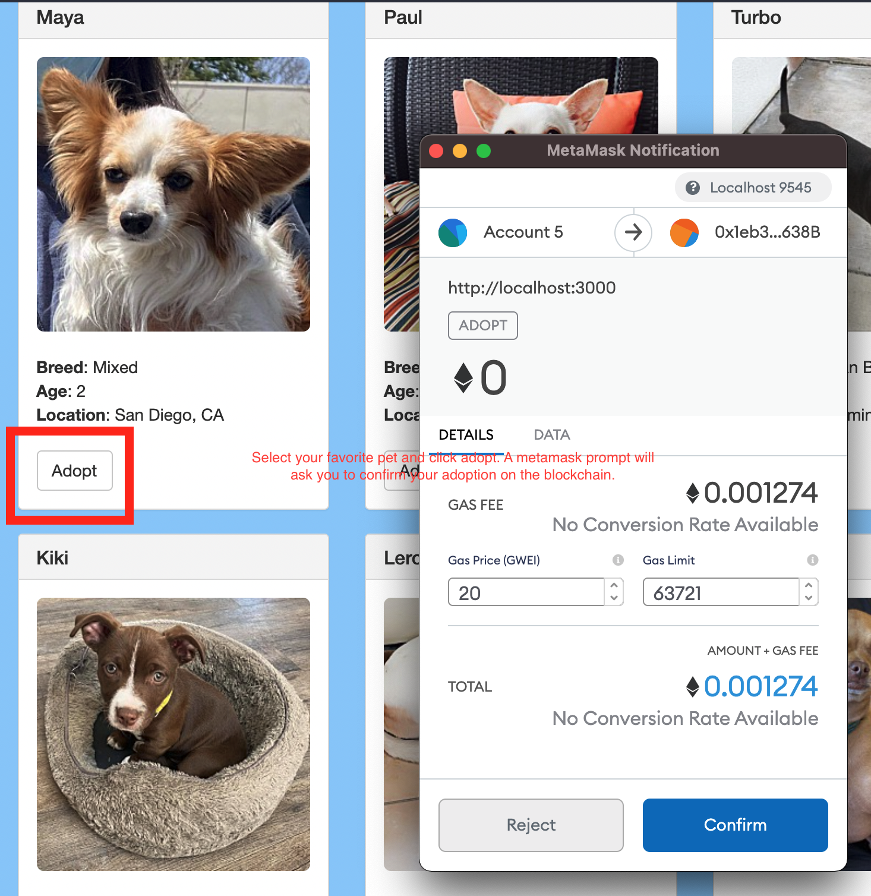
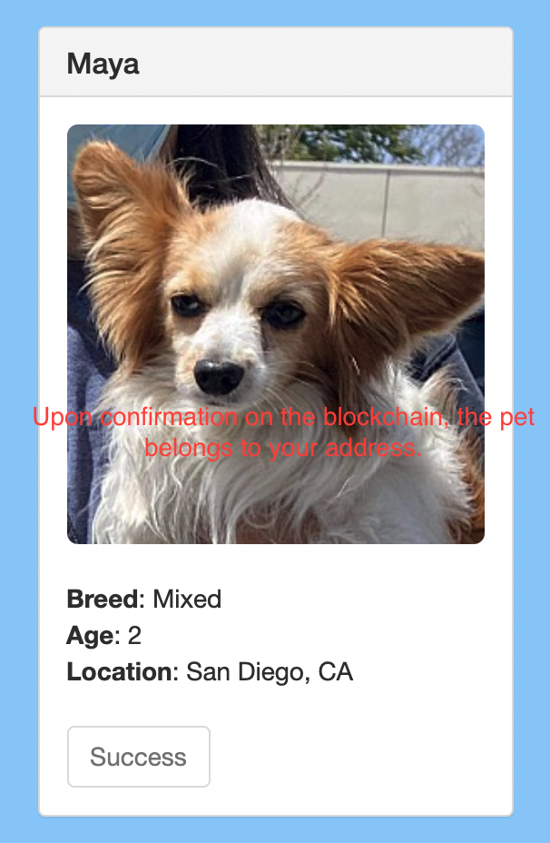

# Blockchain Pet Shop

 
A blockchain based pet adoption resource that uses the truffle framework and smart contracts. Pets listed in the shop can be adopted by users of an EVM based blockchain.

## Requirements

- NodeJS v16.3
- Truffle v5.4
- Metamask or web3 compatible wallet
- Ganache-Core 2.13.2

## Instructions

Run the following commands to get started.

1. Start Ganache on port 7595
2. Run `npm install`
3. [Configure](https://www.trufflesuite.com/docs/truffle/getting-started/truffle-with-metamask) Metamask to use the locally generated ganache blockchain.
4. Compile the smart contracts `truffle compile`
5. Migrate the samrt contracts `truffle migrate`
6. Serve the project `npm run dev`

## Usage

The pet shop can be accessed in the browser via localhost:3000

Various pets are displayed for adoption. Select a pet and click "Adopt" to get started.

 

Confirm the transaction on the ganache blockchain using Metamask. The transaction will confirm instantly on a
local network.

Once the transaction is confirmed, the Adopt button will change to Success, indicating that the transaction was successful
and the pet now belongs to your address.

## Notes

Pets can only be adopted once and are persistent. There is no functionality for placing pets for adoption or deleting them. Reset your local ganache blockchain
to clear pet allocations.

## Credits

Built following the [Truffle tutorial](https://www.trufflesuite.com/tutorial).
